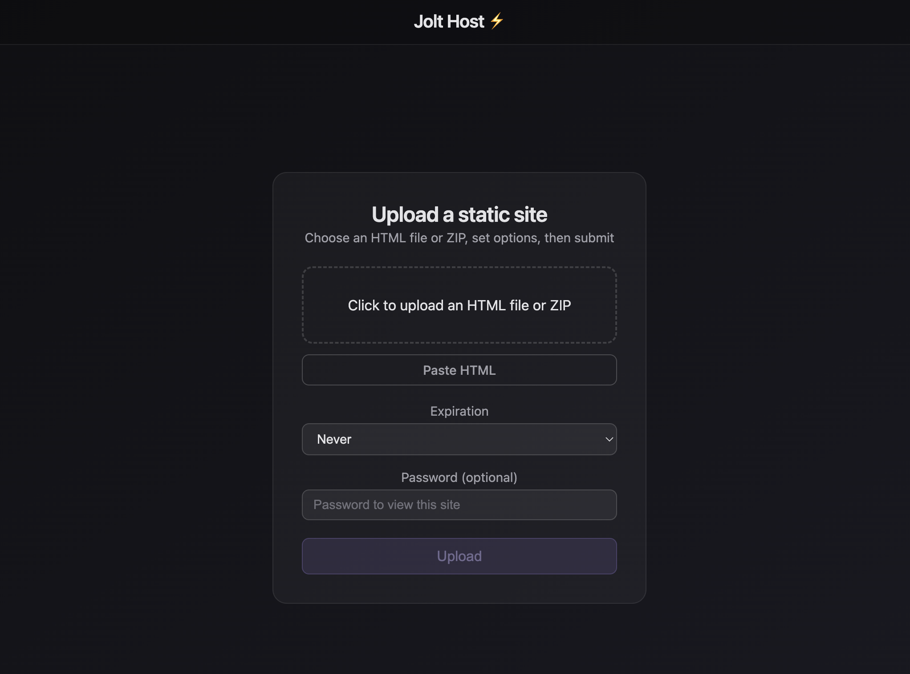

# JoltHost — Static Site Pastebin



A minimal pastebin for static sites: upload an HTML file, paste raw HTML, or upload a ZIP and get a shareable URL. Built with **Nuxt 3**, **SQLite** (better-sqlite3), and **Node fs**.

## Requirements

- **Node.js** ≥ 18 (recommended ≥ 20 for Nuxt 3)

## Setup

```bash
npm install
npm run dev
```

Open [http://localhost:3000](http://localhost:3000).

For the **admin dashboard** at `/admin`, set an admin password (see [Environment](#environment)).

## Features

- **Two ways to publish**
  - **Upload** — `.html` or `.zip` via drag-and-drop or file picker at `/`, or via `POST /api/upload`
  - **Paste** — raw HTML at `/paste` or via `POST /api/paste` (writes a single `index.html`)
- **HTML Text Editor** — visual text editor at `/editor`
  - Upload an `.html` file or paste raw HTML
  - Preview the rendered page in an interactive iframe
  - Hover over any text element to see a popover with an "Edit" action
  - Click to edit text inline, then save changes live in the preview
  - Click "Generate HTML" to produce clean output with all edits applied
  - Copy the result to clipboard or download as `index.html`
  - Entirely client-side — nothing is published or saved to the server
- **Short slugs** (e.g. `quick-apple-42`) for URLs like `yoursite.com/view/quick-apple-42`
- **Static serving** — `/view/[slug]` serves the entry `index.html`; `/view/[slug]/**` serves assets (CSS, JS, images) with correct `Content-Type`
- **Password protection** — optional password per paste; visitors see an unlock page; you get a shareable **unlock URL** (`?unlock=TOKEN`) so they can view without typing the password
- **Expiration** — optional auto-delete: `1h`, `8h`, `24h`, `1w`, or `1d`
- **Owner token** — returned on create; use it to update password or expiration via API (or bookmark `url_with_owner_token`)
- **Admin dashboard** — list uploads (filter by date, password-protected), delete pastes, set/clear passwords, manage **API tokens** for programmatic uploads
- **Rate limit** — 25 uploads per IP per hour (sliding window)

## Authentication

- **Anonymous API uploads are disabled.** To create pastes/upload files you must use either:
  - **Web** — upload at `/` or paste at `/paste`; a session cookie is set so that browser can upload.
  - **API token** — create tokens in the admin dashboard; send `Authorization: Bearer jolt_xxxxxxxx...` on `POST /api/upload` or `POST /api/paste`.

## API

### Create content

| Method | Endpoint | Auth | Description |
|--------|----------|------|-------------|
| `POST` | `/api/upload` | Web session or API token | `multipart/form-data`: `file` (`.html` or `.zip`), optional `password`, `expiration` (`1h`, `8h`, `24h`, `1w`, `1d`). Returns `slug`, `url`, `entry_point`, `owner_token`, `url_with_owner_token`, and (if password set) `url_with_unlock`. |
| `POST` | `/api/paste` | Web session or API token | JSON body: `html`, optional `password`, `expiration`. Same return shape as upload. |

Upload size limit: default 25MB; set **`NUXT_JOLTHOST_UPLOAD_MAX_BYTES`** (bytes) to change (e.g. `52428800` for 50MB).

### Manage a paste (owner token)

| Method | Endpoint | Body | Description |
|--------|----------|------|-------------|
| `POST` | `/api/paste/[slug]/password` | `{ owner_token, password }` | Set or change password. |
| `POST` | `/api/paste/[slug]/expiration` | `{ owner_token, expiration }` | Set expiration (`1h`, `8h`, `24h`, `1w`, `1d`) or omit/empty to clear. |

### Admin (requires admin session)

| Method | Endpoint | Description |
|--------|----------|-------------|
| `POST` | `/api/admin/login` | Log in (body: `password`). |
| `POST` | `/api/admin/logout` | Log out. |
| `GET` | `/api/admin/uploads` | List uploads (query: `page`, `dateFrom`, `dateTo`, `protected`). |
| `GET` | `/api/admin/tokens` | List API tokens. |
| `POST` | `/api/admin/tokens` | Create token (body: `nickname`); returns `token` once. |
| `POST` | `/api/admin/tokens/delete` | Delete token (body: `id`). |
| `POST` | `/api/admin/paste/[slug]/delete` | Delete paste and its files. |
| `POST` | `/api/admin/paste/[slug]/password` | Set/clear password (body: `password`); no owner token needed. |

More detail and examples: [docs/how-to-use-upload-endpoint.md](docs/how-to-use-upload-endpoint.md).

## Data

- **Database** — `./data/jolt.db` (SQLite). Tables: `uploads` (`id`, `slug`, `entry_point`, `password_hash`, `owner_token`, `created_at`, `expires_at`), `api_tokens` (`id`, `nickname`, `token_hash`, `created_at`).
- **Files** — `./storage/[slug]/` — one folder per paste.

## Environment

See [.env.example](.env.example). Main options:

| Variable | Purpose |
|----------|---------|
| `JOLT_ADMIN_PASSWORD` or `NUXT_JOLTHOST_ADMIN_PASSWORD` | Admin dashboard password (required for `/admin`). |
| `JOLT_VIEW_SECRET` | Secret for signing view/unlock cookies and tokens. |
| `JOLT_ADMIN_SECRET` | Secret for admin session cookie (defaults to `JOLT_VIEW_SECRET`). |
| `JOLT_WEB_SECRET` | Secret for web upload session cookie. |
| `NUXT_JOLTHOST_UPLOAD_MAX_BYTES` | Max upload size in bytes (default 25MB). |

## Docker / VPS deployment

Build and run with Docker (data and uploads persist in named volumes):

```bash
docker compose up -d --build
```

App is at [http://localhost:3000](http://localhost:3000). On a VPS, put a reverse proxy (e.g. Caddy or Nginx) in front and optionally set `NITRO_PORT=80` or map `80:3000`.

## Scripts

- `npm run dev` — dev server
- `npm run build` — production build
- `npm run preview` — preview production build
- `npm run test` — run all tests
- `npm run test:unit` — unit tests (server)
- `npm run test:integration` — integration tests
- `npm run test:fixtures` — rebuild test fixtures (e.g. dummy ZIP)
